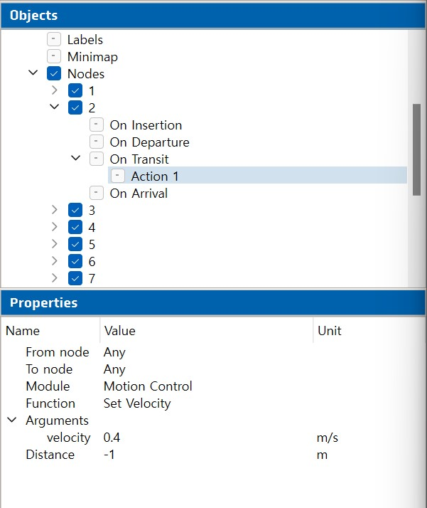

# ANT LAB 정리

## vehicles

AGV 차량에 관련된 모든 속성(size, shape, speed etc....)를 set 할 수 있다.

## Localization 

로봇의 저장된 Map 정보와 현재 로봇이 있는 위치를 synchronization 하여 정확한 위치에 로봇을 위치 시킴

## Routes 

- max velocity: 일반적인 속도

> node 관련

- Distance: -무한대 ~ + 무한대
  - 노드를 원점을 0으로 기준을 잡고 -1 이면 노드 도착 1m 전 에 변화, 1 이면 노드를 지난후 1m지나서 변화 
- veiocity: 변화 지점부터 속도를 설정값으로 변화

## testing 

