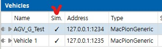
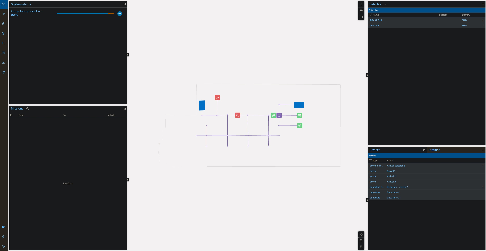

# Ant Server

ANT Server란 실제 AGV없이 가상의 Simulation에서 AGV를 이동 및 테스를 제공한다. 또한 다수의 AGV를 적용하여 충돌 테스트및 주행시 문제가 없는지 파악한다.

## server 실헹 방법 

1. ant lab 실행(execution)
2. Ant lab의 Vehicles페이지에서 sim 부분 체크 표시
 

1. Ant Server 실행
2. Ant lab에서 Apply project

3. Ant vehicles simulator 실행
4. Ant monitor 실행
    - ID: admin
    - PW: 123456

-정상적으로 실행된 창-

## ANT monitor 시뮬레이션 작동 법 

> Vhicles 등록 법

> Departure(출발) Arrival(도착지) 설정 법

> Departure(출발) Arrival(도착지) 설정 법

