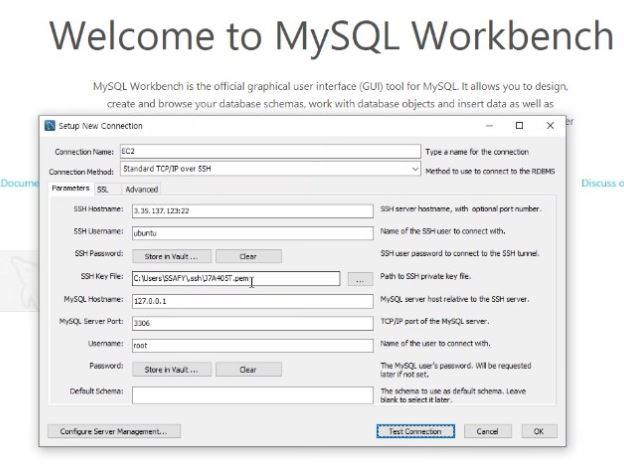

# EC2_DB, IoT 차량 연동

- iot 차량 

mysql 설치 
```py 
$ sudo get-apt update
$ sudo get-apt upgrade
$ pip install mysql-connector-python
$ sudo pip install mariadb
```

py 코드
```py
#import paho.mqtt.client as mqtt # mqtt 라이브러리 
import mysql.connector as mariadb # db연결 라이브러리

# EC2 주소, root, db_pw, database_이름
less_db = mariadb.connect(host="3.35.137.123",user='root',password='lessGO405',database='lessgo') # NALDA_db와 연결
cur = less_db.cursor() # cursor 지정

cur.execute("SELECT * FROM RDi")

print(cur.description)
print()

for row in cur:    print(row)

cur.close()
conn.close()
```

- EC2 

1. Mysql db 생성
2. Mysql Workbench 연동 확인


