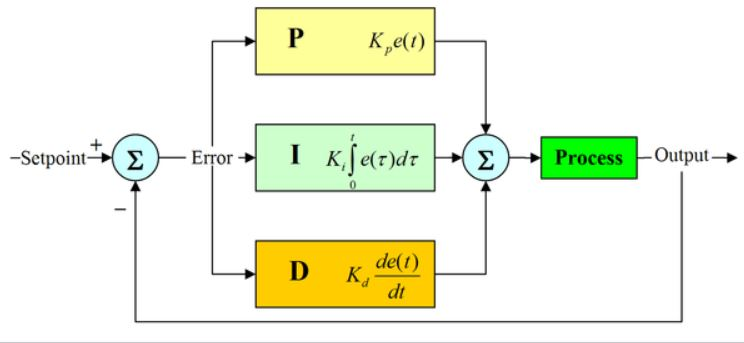
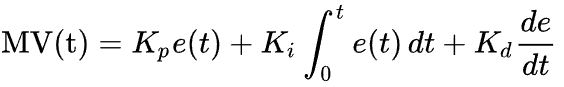

# PID 제어

PID 제어란 원하는 값에 도달하기 위한 기초적인 자동 피드백 제어 방법중 하나입니다.
PID 제어는 수식이 매우 간단하고 제어대상의 모델이 필요하지 않고 구현 난이도 대비 목표치 추종이나 외란 감쇄 효과에 탁월하다. 본 특화프로젝트에서는 PID_control.py에 구현되어 있다.

> 기본 구성

<br>




- P(비례)Proportinal , I(적분)Integral, D(미분)Differential 를 의미.

목표속도(목표), 현재속도(현재), 목표속도-현재속도(오차) 값을 가지고 P(비례), I(적분), D(미분)를 통해 현재 값을 목표 값으로 수렴시 킬 수 있다. 이를 위해서는 P,I,D의 값을 적절히 튜닝 하는 과정이 필요하다. 만약 적절한 이득 값을 찾지 못하면 시간이 지나도 오차가 계속 남아 있거나 목표 값에서 더 멀어져 시스템이 불안정 해질 수 있다.

- P 값을 너무 높이면 움직이는데 많은 힘을 사용하여 딱딱해질수 있다.
- I 높이면 과거 값에 너무 집착하여 
- D 오차의 변화율: 아주 짧은 시간의 오차의 변화율에 변화한다.
```
Rise Time: 목표값이 10% ~90% 까지 도달 걸린 시간
overshoot 현재 값이 목표 값보다 커졌을 때의 값
setting time 목표 값의 5%이내에 들어갈 때의 시간
Steady-State Error 정상 상태에 도달하고 나서 존재하는 에러
```
아래는  KP, KI, KD 의 이득값을 상승시켰을 경우 나타나는 결과 이다.

|CL Response| Rise Time| Overshoot|setting time|steady-state Error|
|---|---|---|---|---|
|KP|감소|상승|약간 변화|감소|
|KI|감소|상승|상승|제거|
|KD|약간변화|감소|감소|변화 없음|

쉽게 설명하자면 <br>
KP: 차량의 오차 위치를 얼마나 강하게 보정 할것이냐, 즉 차량이 가고싶은 지점과 현재 향하고 있는 지점의 차이값에 가중치를 얼마나 줄것 인가<br>
KI: 기존에 있던 오차범위를 다 합친 양을 기준으로 얼만큼 보정 할 것이냐, 즉 기존에 우로 3 좌로 2 이동했다면 둘의 합이 1 이기 때문에 KI의 값은 1의 값에 어느정도의 가중치를 줄것인가를 결정한다.<br>
KD: 오차의 변화율의 크기 따라 어느정도로 보정을 할 것이냐, 즉 직전과 비교하여 변화 값의 기울기를 측정하여 그값에 얼만큼 가중치를 줄것인가


```py
    error = target_vel - current_vel # 내가 원하는 속도 - 현재속도 = 오차값
    p_control = self.p_gain*error
    self.i_control += self.i_gain*error*self.controlTime
    d_control = self.d_gain*(error-self.prev_error)/self.controlTime

    output = p_control+self.i_control+d_control
    self.prev_error = error
    print(error)
    return output
```
- PID 참고 사이트
https://m.blog.naver.com/jsrhim516/222015965919