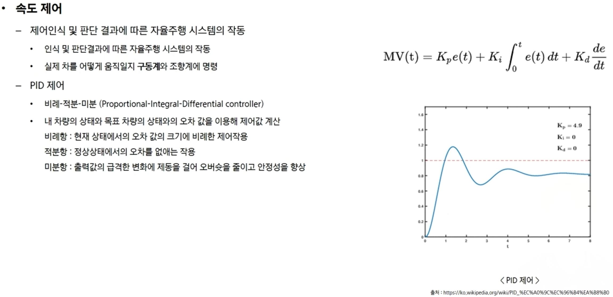

# 사전학습 정리

## 자율주행 Process 

자율주행 Process는 크게 3가지 단계 (인지 -> 판단 -> 제어) 순으로 정리된다.

1. ## 인지 (주변 상황에 대한 정확한 인식)
   - 이미지가 입력으로 주어졌을 때, 해당 객체들을 인식하고 객체가 무엇인지 인지하는 기술
   - Deep learning object detection: 물체를 판단한는데 사용 ex) YoLo
   - 정밀지도: 자율주행에 필요한 정보를 3차원으로 제작한 전자 지도. 정밀 지도의 해상도 기준은 오차율 0.25m 이하를 정밀지도라고 말한다. 
   - ex) 차선, 도로 시설(중앙 분리대, 터널), 표지 시설(노면 표시, 신호기) 등을 표시 한다.
2. ## 판단  (인식에 기반한 정확한 판단)
   -  경로 계획
3. ## 제어  (판단에 기반한 올바른 제어)
    - 속도 제어

 

> 정밀지도 종류
- ## pointCloud Map: 
  - 3차원 좌표를 가지고 있는 점드로 불규칙하게 구성된 데이터, 점구름 또는 점 구름 또는 점군데이터로 불림
  - 라이다센서, RGB-D 센서로 부터 수집된 데이터를 말함
- ## HD Map(vector Map):
  - 신호등 차선 교차로 들을 벡터 데이터로 표현하여 지도를 생성, 자율 주행 차량의 성능에 큰 영향을 미침
- ## Grid Map:
  - 격자의 형태로 전달되어지는 지도, 포인트 클라우드 방식보다 용량이 작기 때문에 정밀도는 상대적으로 떨어진다.

 

> 자율주행 센서
- 카메라
  - 객체를 인식하기위해 필요
  - 밤, 또는 악천후 정보 품질이 떨어짐
- 라이다
  - 빛을 매개체로 시물간 거리를 파악
  - 매우 정밀
  - 에너지를 많이 사용, 가격이 비쌈
- 레이더
  - 전파를 매개체로 사물간 거리 및 형태를 파악
  - 라이다 센서보다 정밀도는 떨어지지만 소형화가 가능
  - 가격이 라이다 보다 저렴
- GPS
  - 낮은 단가와 준수한 정확성
  - 위성으로 부터 내려온 위치와 시간정보를 계산하여 현재 자신의 위치를 특정합니다. 이때 필요한 최소 위성 갯수는 3개 입니다.(통상 더 많은 인공 위성을 사용)
- IMU

 

> 경로 계획

경로 계획에는 크게 2가지의 방식이 존재

- ## 전역 경로 계획
  - 지도에 기반하여 경로를 자율적으로 생성
  - 가장 직관적인 방식으로 직접 주행을 하여 차량의 위치 좌표를 기록하는 방법
  - 차량의 위치정보 하나하나가 waypoint가 됨.
  -  경로 생성 -궤적:
     -  1차함수: 단순히 시작점과 끝점을 직선으로 잇는 방식(구현 간단) 세타L  값이 크기 때문에 차량에 무리를 주고 주행 질감에도 좋지 않다.
     -  3차함수: 시작과 끝점을 곡선으로 잇는 방식(구현 어렵)
- ## 지역 경로 계획
  - 지도 정보로 없는 예기치 못한 상황을 센서를 이용하여 장애물을 피해가며 경로를 재생성  

-  Pure Pursiut 알고리즘

- PID제어

## ROS 란 

- Robot Operating Systemd의 약어로 로봇을 개발하는데 있어 필수적인 라이브러리를 제공, 적을 때도 약어기 때문에 ROS 모두 대문자로 기입을 한다.
- application 부분만 개발하면 되기 때문에 시간 비용 절약 효과가 있다.

> ROS 기본 

- Tool
  - ROS RViz : 센서 데이터 등의 시각화 도구
  - Qt: 기반 GUI 응용 개발 도구
  - GAZEBO: 물리 엔진 기반의 3차원 시뮬레이터 (이번 프로젝트에서 사용X)

- 용어 정리
  - ROS Master: 노드와 노드 사이의 연결과 통신을 위한 서버
    - 실행 명령어: rescore 
  - ROS Node: ROS에서 실행되는 최소 단위 프로세스
  - ROS Message: 노드와 노드 간의 데이터를 주고 받는 양식
  - ROS Topic: 
    - 단방향의 연속적인 송 수신 방식
    - 메세지를 송신하기 위해 토픽으로 마스터에 등록하여 메시지를 보낸다.
  - ROS Service: 양방향의 일 회성 송 수신 방식

  - ROS Publish: Topic에 원하는 메세지를 담아 송신(publish) 하는것
  - ROS Publisher: 
    - Publish를 하기 위해 Topic을 포함한 자신의 정보를 마스터에 등록하고 Subscriber Node에 메세지를 보냄
    - 하나의 노드에 여러 개의 publisher를 선언 할 수 있다.
  - ROS Subscribe: Topic 내용에 해당하는 message를 수신하는 것
  - ROS Subscriber:
    - subscribe를 수행하기 위해 Topic을 포함한 자신의 정보를 마스터에 등록 수신하고자 하는 Topic의 정보를 master로 받는다.
    - 하나의 노드에 여러개의 subscriver를 선언 할 수 있다.
