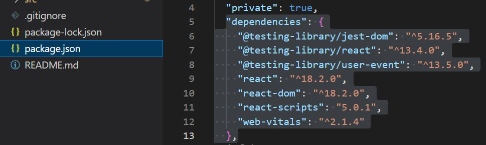

# javascript총정리

참고사이트:

React 강의
https://www.youtube.com/watch?v=05uFo_-SGXU&list=PLZKTXPmaJk8J_fHAzPLH8CJ_HO_M33e7-&index=1

npx-create-react-app app-myname 설치 오류 해결
https://velog.io/@seungmini/npx-create-react-app-myapp-%EC%84%A4%EC%B9%98-%EC%98%A4%EB%A5%98-%ED%95%B4%EA%B2%B0

node.js 란?
https://www.youtube.com/watch?v=pTm5E3jcOeY

## React 가상환경 설정
cmd 창에 다음명령어 입력
* test대신 다른 이름을 사용해도됨
```
npx create-react-app test
```


## Javascript 기본

> 알고리즘 설명(+ 내가 느낀 점):
문법의 경우 C:75% + Python:20% + JavaScrpit만의 특징?: 5% <br>

- Hosting:
C의 경우 함수 선언 후 함수 아래에서 사용해야 하지만 JS의 경우 함수 선언 후 위에서 사용해도 ok. 왜냐면 컴파일 하기전 선엄된 함수를 먼저 모아서 초기화 해둠 이를 Hosting이라 한다.

문법:
- const , let을 이용해서 변수 선언, 동일한 이름의 변수를 다시 선언 할 수 없음. -> error 발생을 최소화
  - const: 변수 값 변경 불가
  - let: 변수 값 변경 가능


- console.log(): 변수 값을 console에서 확인하기 위해 사용 

```js
const name = "Mike";
const a = "나는 ";
console.log(a + name) ; // 이런식으로 사용 가능 
```

- a = true 
- b = false
- typeof 객체 type을 확인 
```js
console.log(typeof 3);        //number
console.log(typeof name);     //string 
console.log(typeof true);     //boolean
console.log(typeof "Hello");  //string
console.log(typeof null);     //object
console.log(typeof undefined);//undefined
```
- 기본 매소드
  - alert : 알려줌  + 확인 버튼
  - prompt: 입력받음
    - prompt로 받으면 모두 문자열 취급
  - confirm:확인받음 + 확인 or 취소버튼

장점: 간단하게 바로 적용 가능 
단점: 예쁘게 나오지 않음 -> 해결책: HTML을 사용해서 꾸미기 가능

> 형변환 (대문자 시작 주의!)
```
String()
Number()
Boolean()
```

>switch 문
```js
let fruit = prompt("무슨 과일을 사고 싶나요?");

switch(fruit){
  case '사과':
    alert("사과2");
    break;
  case '딸기':
    alert("딸기2");
    break;
  default :   //default를 쓰지 않으면 warning
    console.log('그런 과일은 없습니다.')
}
```

> 함수 선언 방법

```js
//1
let add function(){
  .....
}

//2 arrow function
let add = ()=>{
  ......
}

```

## React 구성 <hr>

> React로 만든 페이지는 component로 구성되어있다.
- App.js에 속해있다.
- 장점: 비슷한 부분들은 코드를 재사용 가능 , 유지보수에도 유리

 

빨간 부분이 각각의 component 


> component 예시
```html
function App() {
  return (
    <div className="App">
      <header className="App-header">
        
        <p>
          {/* Edit <code>src/App.js</code> and save to reload. */}
          Jnag Myoung Geun
        </p>
        <a
          className="App-link"
          href="https://reactjs.org"
          target="_blank"
          rel="noopener noreferrer"
        >
          Learn React ~~~!
        </a>
      </header>
    </div>
  );
}
```

> React 코드 구성

- node_modules
    - 프로그램 실행시 사용되는 모든 dependency 모듈들이 모여 있음.
    - 구성 내용은 pakage.json에 dependencies로 기록되어있음. 따라서 git에 올리는 경우 용량이 큰 node_modules를 제외하고 package.json파일을 올린후 npm install만 해주면 동일한 환경에서 개발이 가능.

    

- public
    - index.html 에서 div 에따라 실행 환경이 결정 
    ```html
    <div id+"실행환경"><div>
    ```

- src
    - 소스폴더라 불리며 대부분의 작업이 src파일에서 작성된다.
    - App.js
        - App에서 보여지는 내용을 수정
        - component들의 집합. 모든 compoenent들은 대문자로 시작 ex)App
    - index.js
        - import App from './App' app js에 구현된 내용. 


> React 실행

터미널 창에 아래 명령어 입력

```
 npm start
```


##  html 기본 구조 만들기 <hr>

- 내부 스크립트방식과 외부스크립트방식 크게 두가지로 나눌 수 있다.

- 쉽게 생성하는 법 "!"를 치고 tab키를 누른후 enter를 치면 기본 구조 자동완성

```html
<!DOCTYPE html>
<html lang="en">
<head>
    <meta charset="UTF-8">
    <meta http-equiv="X-UA-Compatible" content="IE=edge">
    <meta name="viewport" content="width=device-width, initial-scale=1.0">
    <title>Document</title>
</head>
<body>
    
</body>
</html>
```

> 내부스크립트 방식

한개의 html파일 body안에 script를 작성하는 방식

```html 
<body>
    <script>
        console.log("hi");
    </script>
</body>
```

> 외부스크립트 방식

main.js 추가 파일을 생성해 작성하주는 방식

```html
<body>
    <script src="main.js"></script>
</body>
```