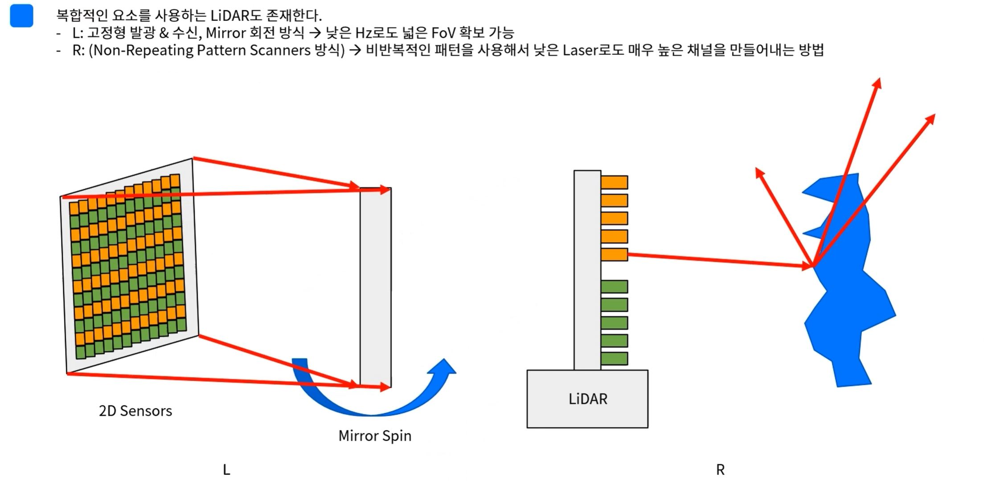
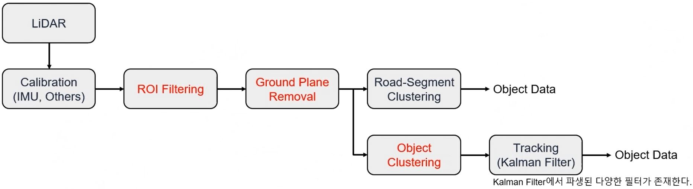

# LiDAR

자율주행 데브코스를 통해 학습한 내용을 기반으로 LiDAR에 대해 정리


LiDAR 종류 <hr>

- Mechanical 3D spinning LiDAR: 360탐색 가능 , 회전자가 외부에 노출되어있어 내구성 문제 , 비교적 저렴한 비용
- Solid state LiDAR: 전방만 탐지 가능, 그나마 내구성이 좋음
- MEMS LiDAR: 굉장히 넓은 범위를 탐지 가능, 높은 제작 난이도



- L: 고정형 발광& 수신 + Mirror 회전방식: 낮은 Hz로도 넓은 FoV 확보 가능 -> 높은 내구성 
- R: 비반복적 패턴 사용 -> 낮은 채널로 매우 높은 채널을 만드는 기술(최근에 각광 받고 있는 중)

<br>
LiDAR Process <hr>

라이다의 기초 프로세스



<br>

LiDAR 참고 <hr>

- LiDAR가 한바퀴 돌면서 스캐닝 하는 것을 1step 이라 한다.
- FoV(Field of view)로 화각을 나타냄.
- LiDAR는 Ethernet Packet 구조를 사용. 라이브러리 또는 SDK를 제공하지 않는 다면 직접 Packet을 Un-Pack하는 과정이 필요
    - Packet 이란 네트어크에서 출발지와 목적지간에 라우팅 되는 데이터의 단위
    - SDK(Software Development Kit) 커스텀 앱을 제작 할 수 있는 도구의 모음

- image를 다루는 라이브러리로는 OpenCv가 있다면 LiDAR의 Point Cloud를 다루는 라이브로리로 PCL이 있다. ROS를 사용한다면 PCL은 자동으로 설치된다.

LiDAR 데이터 시각화 <hr>

크게 2가지 방법이 존재

- PCLVisualizer
    - 사용법 다소 복잡, 많은 기능 보유
- Cloudviewer
    - 사용 간단, 필수기능만 보유


> CMakeLists.txt 작성 방법

```cmake
cmake_minimum_required( VERSION 3.10 ) # 버전에 맞게 작성

# Create Project
project( project_name )
add_executable( project_name.cpp )

# Set StartUp Project (Option) 사용해도 되고 안해도 되고
# (This setting is able to enable by using CMake 3.6.0 RC1 or later.)
#set_property( DIRECTORY PROPERTY VS_STARTUP_PROJECT "project" )

# Find Packages
find_package( PCL 1.12 REQUIRED )

if( PCL_FOUND )
  # [C/C++]>[General]>[Additional Include Directories]
  include_directories( ${PCL_INCLUDE_DIRS} )

  # [C/C++]>[Preprocessor]>[Preprocessor Definitions]
  add_definitions( ${PCL_DEFINITIONS} )
  
  # For Use Not PreCompiled Features 
  #add_definitions( -DPCL_NO_PRECOMPILE )

  # [Linker]>[General]>[Additional Library Directories]
  link_directories( ${PCL_LIBRARY_DIRS} )

  # [Linker]>[Input]>[Additional Dependencies]
  target_link_libraries( project ${PCL_LIBRARIES} )
endif()
```