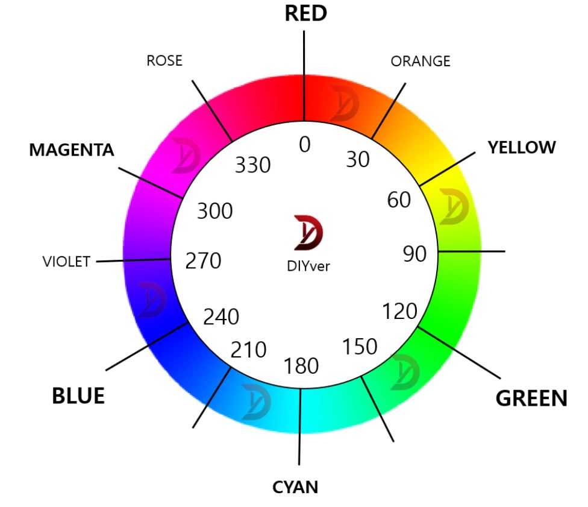
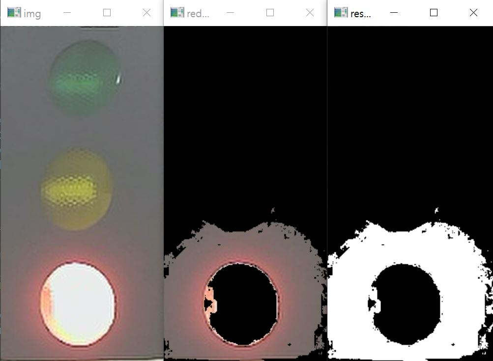

# 색상 검출

- 참고사이트: https://diyver.tistory.com/98
- 영상은 RGB 값이 포함된 test.mp4 파일을 기반으로 동작

- 핵심 내용:
    - opencv 에서 색상을 검출하는 가장 중요한 값은 HSV 중 H(Hue)값이다.
    - HSV 값을 추출하는 방법은 여러가지가 있는데 나는 그림판을 이용해서 검출 했다.
    - 그림판을 이용하는 경우 hue 값의 범위가 0~240 인데 OpenCv는 0~ 180 까지이다.
        - 따라서 그림판 hue 값 * 0.75 를 해야 가장 정확한 값이 추출된다.
    - red의 경우 0~ 360을 기준으로 했을 때 약 350~ 10 사이의 값을 가진다. (HSV가 원통형임으로) <br>
    

|함수|용도 |변수|
|---|---|---|
|inRange(img_hsv, lower_red, upper_red, red_mask)|색상 범위 설정|(탐색 이미지, 최소, 최대, 저장 이미지)|
|addWeighted(red_mask, 1.0, red_mask2, 1.0, 0.0 , result)|다른 범위 2개를 합성|(범위1,1가중치, 범위2,2가중치,추가가중치,저장위치)|

> 결과 <br>



> 코드
```C++
#include <opencv2/opencv.hpp>
#include <iostream>

using namespace cv;
using namespace std;

int main()
{
	//Mat img = imread("red.JPG");
	//Mat img = imread("yellow.JPG");
	Mat img= imread("example2.PNG");
	Mat img_hsv , img_hsv_red;
	Mat hsv;

	//  H , S , V  검출======================================================
	//cvtColor(image, hsv, COLOR_BGR2HSV); //convert BGR to HSV
	//vector<Mat>  channels;
	//split(hsv, channels); //split to h,s,v
	////channels[0] 색상(H),  channels[1]  채도(S),  channels[2]  명도(V)
	////각 채널 출력
	//imshow("Original", image); //original
	//imshow("Hue", channels[0]); //hue
	//imshow("Saturate", channels[1]); //saturate
	//imshow("Value", channels[2]); //value
	////channels[2] = 255; //value to max  value 값을 바꾸면 어떻게 될까 추측
	//merge(channels, hsv); //merge h,s,v  hsv요소들 결합. 
	//Mat newImage;
	//cvtColor(hsv, newImage, COLOR_HSV2BGR); //convert HSV to BGR
	//imshow("Fixed Value Image", newImage);
	//=========================================================================

	cvtColor(img, img_hsv, COLOR_BGR2HSV);

	Mat yellow_mask, yellow_image;

	// Hue 범위 설정
	Scalar lower_yellow = Scalar(20, 20, 100); // yellow 범위
	Scalar upper_yellow = Scalar(32, 255, 255);

	Scalar lower_red1 = Scalar(170, 20, 100);     //red 범위1
	Scalar upper_red1 = Scalar(180, 255, 255);

	Scalar lower_red2 = Scalar(0, 20, 100);     //red 범위2
	Scalar upper_red2 = Scalar(10, 255, 255);

	// 노란색 추출
	inRange(img_hsv, lower_yellow, upper_yellow, yellow_mask);
	bitwise_and(img, img, yellow_image, yellow_mask);

	imshow("yellow_image", yellow_image);  // 노란색 이미지 출력
	imshow("yellow_mask", yellow_mask);

	Mat red_mask1, red_mask2 ,red_image , red_mask; 
	Scalar added_red;

	// 빨간색 추출
	inRange(img_hsv, lower_red1, upper_red1, red_mask1); // red 범위1 mask1 생성
	inRange(img_hsv, lower_red2, upper_red2, red_mask2); // red 범위2 mask2 생성
	addWeighted(red_mask1, 1.0, red_mask2, 1.0, 0.0 , red_mask);   // mask1 + mask2 = red_mask
	bitwise_and(img, img, red_image, red_mask); // red_mask -> RGB타입으로 출력.

	imshow("red_image", red_image); // masking된 이미지 GRB타입으로 출력
	imshow("result", red_mask); // masking
	imshow("img", img);


	Mat com;
	//Scalar scalar = mean(yellow_image);   // 평균
	//cout << "mean:" << scalar << endl;
	waitKey(0);
    return 0;
}
```
