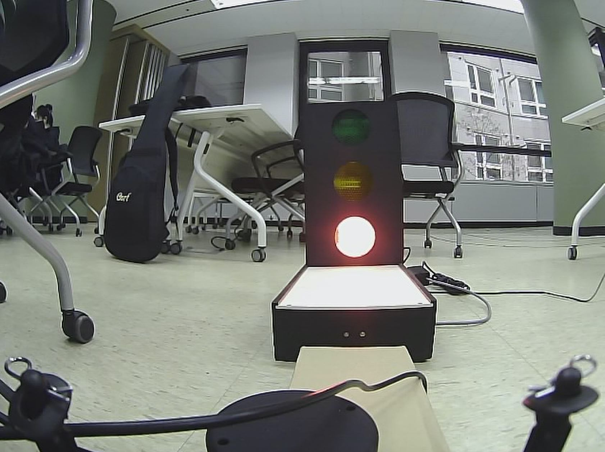
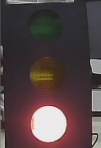
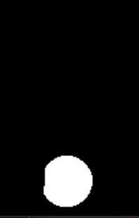
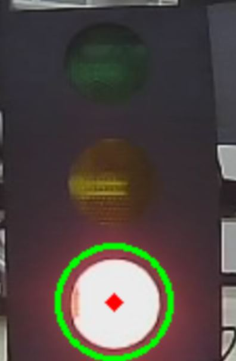
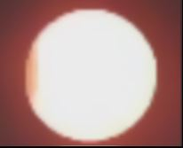
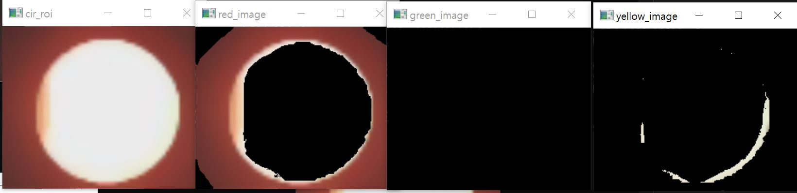
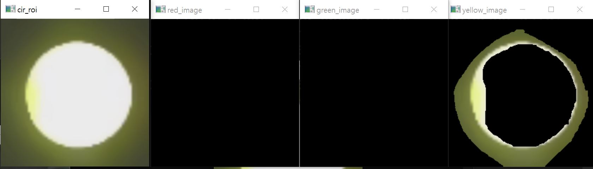
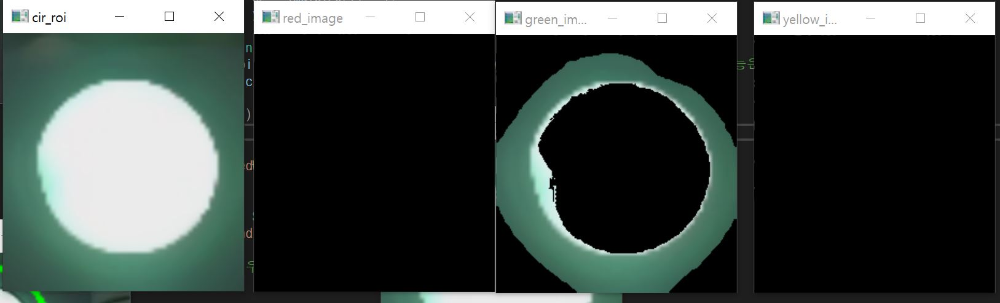

# 신호 검출 최종 정리

final update: 23.01.27

> 목표

Xycar를 이용하여 표지판 및 신호등을 인식하여 신호에 맞춰 차량을 이동, 이때 인식된 신호등의 신호를 판별 알고리즘 개발

> 개발 방향

threshold를 이용하여 영상에서 밝은 부분을 추출하고 주변광의 색상을 이용하여 신호를 판단

> 문제점 및 해결 방향

1. problem: 켜진 원의 경우 중심점이 색이 존재하지 않는 백색이 대부분 존재 

    - sol: 원의 주변광을 확인하여 색상을 판별

2. problem: 원을 검출하는 경우 리소스를 많이 차지 + 정방향에서 보지않는 경우 원을 검출 하지 못함 or 이상한 곳에 원 생성

    - sol: Houghcircle 대신 threshold를 사용하여 원대신 HSV의 밝은 부분 만을 추출하여 판별

3. threshold의 중심판별 어려움
    - sol: 발광중인 이미지의 각 픽셀값의 평균을 구해 중심점을 추출 
    
> 함수 설명

1. video_input_roi() :  final_test.avi 영상파일에서 신호등 부분에 해당되는 roi 영역을 설정.





2. threshold_gary_roi(): 신호등에서 밝기에 따라 이진화한 후 켜진 신호 부분을 영역을 설정.





3. hsv_diff_color(): 들어온 신호가 어떤 색상인지 판별 후 색상 출력.

red <br>


yellow<br>


green<br>



> 개발 코드

```c++
#include <opencv2/opencv.hpp>
#include <iostream>
#include<vector>
#include<tuple>
#include<algorithm>
#include<string>
#include<cmath>

using namespace cv;
using namespace std;

bool cmp(tuple<string,int> t1, tuple<string, int> t2) {
	return get<1>(t1) > get<1>(t2);
}

void hsv_diff_color(Mat img_tmp)  // 색상 검출을 위한 코드
{
	Mat img;
	img_tmp.copyTo(img);

	Mat img_hsv;
	cvtColor(img, img_hsv, COLOR_BGR2HSV);
	imshow("img", img);

	// Hue 범위 설정
	Scalar lower_yellow = Scalar(20, 20, 100); // yellow 범위
	Scalar upper_yellow = Scalar(36, 255, 255);

	Scalar lower_red1 = Scalar(170, 20, 100);   //red 범위1 (red는 범위가 170~ 180 , 0 ~10 으로 2개가 존재) + 빨간불의 범위를 20로 상향 조정
	Scalar upper_red1 = Scalar(180, 255, 255);
	Scalar lower_red2 = Scalar(0, 20, 100);     //red 범위2
	Scalar upper_red2 = Scalar(20, 255, 255);

	Scalar lower_green = Scalar(70, 20, 100);    //green 범위2
	Scalar upper_green = Scalar(85, 255, 255);

	// 노란색 추출
	Mat yellow_mask, yellow_image;
	inRange(img_hsv, lower_yellow, upper_yellow, yellow_mask);
	bitwise_and(img, img, yellow_image, yellow_mask);

	imshow("yellow_image", yellow_image);  // 노란색 이미지 출력
	//imshow("yellow_mask", yellow_mask);

	// 빨간색 추출
	Mat red_mask1, red_mask2, red_image, red_mask;
	inRange(img_hsv, lower_red1, upper_red1, red_mask1); // red 범위1 mask1 생성
	inRange(img_hsv, lower_red2, upper_red2, red_mask2); // red 범위2 mask2 생성
	addWeighted(red_mask1, 1.0, red_mask2, 1.0, 0.0, red_mask);   // mask1 + mask2 = red_mask
	bitwise_and(img, img, red_image, red_mask); // red_mask -> RGB타입으로 출력.

	imshow("red_image", red_image); // masking된 이미지 GRB타입으로 출력
	//imshow("result", red_mask); // masking

	// 녹색 추출
	Mat green_mask, green_image;
	inRange(img_hsv, lower_green, upper_green, green_mask);
	bitwise_and(img, img, green_image, green_mask);

	imshow("green_image", green_image); // 녹색 이미지 출력
	//imshow("green_mask", green_mask);

	// 색상별 범위 추출 ===========================================================
	int yellow_sum = 0, red_sum = 0 , green_sum = 0;
	// yellow 범위 추출
	for (int row = 0; row < yellow_mask.rows; row++)
	{
		for (int col = 0; col < yellow_mask.cols; col++)
		{
			uchar b = yellow_mask.at<uchar>(row, col);  // grayscale 이라 uch
			yellow_sum += b;
		}
	}

	// red 범위 추출
	for (int row = 0; row < red_mask.rows; row++)
	{
		for (int col = 0; col < red_mask.cols; col++)
		{
			uchar b = red_mask.at<uchar>(row, col);
			red_sum += b;
		}
	}

	// green 범위 추출
	for (int row = 0; row < green_mask.rows; row++)
	{
		for (int col = 0; col < green_mask.cols; col++)
		{
			uchar b = green_mask.at<uchar>(row, col);
			green_sum += b;
		}
	}

	// 범위 확인
	//cout << "r_sum" << red_sum << endl
	//cout << "y_sum" << yellow_sum << endl;
	//cout << "g_sum" << green_sum << endl;

	// 가장 많은 영역을 차지하는 색상 선택
	vector<tuple<string, int>> v;
	v.push_back(make_tuple("red", red_sum));
	v.push_back(make_tuple("yellow", yellow_sum));
	v.push_back(make_tuple("green", green_sum));

	sort(v.begin(), v.end(), cmp);
	printf("%s\n", get<0>(v[0]).c_str()); // 성능 향상을 위해 printf 변경
	//cout << "추출 색상 값: " << get<0>(v[0]) << endl;
}

// hsv 변환 및 원 검출 => 성능에 영향이 있어 제외. 허프서클이 부정확한 위치에 생성
//void houghcircle_gary(Mat img_con) {  
//	Mat img_copy;
//	Mat img;
// 	img_con.copyTo(img_copy);
//	img_con.copyTo(img);
//
//	imshow("main_image", img);
//	Mat hsv;
//	cvtColor(img, hsv, COLOR_RGB2HSV);
//	medianBlur(img, img, 5); // 원검출 정확도 향샹을 위한 블러처리
//
//	Mat img_houghC;
//	//img.copyTo(img_houghC);
//
//	cvtColor(img, img_houghC, COLOR_RGB2GRAY);
//	//threshold(img_houghC, img_houghC, 150, 255, THRESH_BINARY);
//	//medianBlur(img_houghC, img_houghC, 5);
//	imshow("img_houghC2", img_houghC);
//	//img.copyTo(img_houghC);
//
//	vector<Vec3f> circles;
//	HoughCircles(img_houghC, circles, HOUGH_GRADIENT, 1, 20, 50, 40, 0, 0);//(입력이미지, 출력이미지, method ,dp , 원중심간 거리, parm1,parm2 ,원최대크기, 원최소크기)
//
//	int rad_plus = 0 , cen_r = 0, cen_c = 0; // 반지름 
//
//	cout <<"cs: " << circles.size() << endl;
//
//	for (size_t i = 0; i < circles.size(); i++)
//	{
//		Vec3i c = circles[i];
//		Point center(c[0], c[1]);
//		int radius = c[2];
//		rad_plus = radius * 1.2; // 값이 너무 커지면 불필요한 영역을 침범 + 영상 범위를 넘어가면 error 발생
//		cen_r = c[1];
//		cen_c = c[0];
//
//		circle(img_houghC, center, radius, Scalar(0, 255, 0), 2); // 원 테두리
//		circle(img_houghC, center, 2, Scalar(0, 0, 255), 3);      // 원 중심점
//	}
//	cv::imshow("img_houghC", img_houghC);
//	if (circles.size() == 1) {
//
//		//cout << "rad_plus: " << rad_plus << endl;
//		//cout << "cen_r: " << cen_r << endl;
//		//cout << "cen_c: " << cen_c << endl;
//		Mat cir_roi; // 신호등에서 신호 검출시 검출된 부분 roi 설정.
//		cout << "img_size" << img.size[0] << "," << img.size[1] << endl;
//		int x1 = 0, y1 = 0, x2 = 0, y2 = 0;
//		x1 = cen_c - rad_plus;
//		y1 = cen_r - rad_plus;
//		x2 = cen_c + rad_plus;
//		y2 = cen_r + rad_plus;
//
//		// ROI 영역을 벗어나는 경우 error 방지 예외 처리
//		if (x1 <= 0) x1 = 1;
//		if (y1 <= 0) y1 = 1;
//		if (x2 >= img.size[0]) x2 = img.size[1] - 1;
//		if (y2 >= img.size[1]) y2 = img.size[0] - 1;
//		cout << x1 << ", " << y1 << ", " << x2 << ", " << y2 << endl;
//		cir_roi = img(Rect(Point(x1, y1), Point(x2, y2)));  // 위치 설정
//		//imshow("img_cir", cir_roi_1);
//
//
//		cv::imshow("img_cir", cir_roi);
//		hsv_diff_color(cir_roi);
//	}
//	else {
//		cout << "원 검출X" << endl;
//	}
//
//	//waitKey(0); // 영상의 경우 필요x
//}

void threshold_gary_roi(Mat img_con) {
	Mat img , img_copy;
	Mat hsv;
	img_con.copyTo(img);
	img_con.copyTo(img_copy);

	imshow("main_image", img);
	cvtColor(img, hsv, COLOR_RGB2HSV);
	medianBlur(img, img, 7); // 잡음을 삭제, 최대: 7

	Mat img_houghC;

	cvtColor(img, img_houghC, COLOR_RGB2GRAY);
	threshold(img_houghC, img_houghC, 190, 255, THRESH_BINARY);
	imshow("img_houghC2", img_houghC);


	int num;
	int cen_r =0 , cen_c = 0, cenr_count = 0;
	//cout << "img_houghC.rows: " << img_houghC.rows << " img_houghC.cols: " << img_houghC.cols << endl;
	for (int i = 0; i < img_houghC.rows; i++) {
		for (int j = 0; j < img_houghC.cols; j++) {
			uchar b = img_houghC.at<uchar>(i, j);
			num = b;
			if (num == 255) {
				cenr_count++;
				cen_r += i;
				cen_c += j;
			}
		}
	}
	
	if (cenr_count > 50) {
		cen_r = int(cen_r / cenr_count);
		cen_c = int(cen_c / cenr_count);

		// threshold 반지름 구하기
		int r_count = 0, c_count = 0 , out_row_rad = 0 , out_col_rad = 0;
		num = 0;

		for (int i = 0; i < cen_c; i++) {
			uchar b = img_houghC.at<uchar>(cen_r, i);
			num = b;
			if (num == 255) {
				r_count++;
				out_row_rad += i;
			}
		}
		//cout << "out_row_rad" << out_row_rad / r_count << endl;

		out_row_rad = abs(cen_c - int(out_row_rad / r_count));
		//cout << "out_row_rad" << out_row_rad << endl;
		num = 0;
		for (int i = 0; i < cen_r; i++) {
			uchar b = img_houghC.at<uchar>(i, cen_c);
			num = b;
			if (num == 255) {
				c_count++;
				out_col_rad += i;
			}
		}

		out_col_rad = abs(cen_r - int( out_col_rad / c_count));

		int avg;  // 반지름 평균구하기
		float wedight = 1.4;  // 원 가중치
		out_row_rad *= wedight;
		out_col_rad *= wedight;
		avg = out_row_rad + out_col_rad;

		Point center(cen_c, cen_r);
		circle(img_copy, center, 2, Scalar(0, 0, 255), 3);
		circle(img_copy, center, avg , Scalar(0, 255, 0), 2); // 원 테두리

		Mat cir_roi;
		int x1, y1, x2, y2;

		// 타원
		x1 = cen_c - out_col_rad*2;
		y1 = cen_r - out_row_rad*2;
		x2 = cen_c + out_col_rad*2;
		y2 = cen_r + out_row_rad*2;
		//x1 = cen_c - avg;
		//y1 = cen_r - avg;
		//x2 = cen_c + avg;
		//y2 = cen_r + avg;
	
		if (x1 <= 0) x1 = 1;
		if (y1 <= 0) y1 = 1;
		if (x2 >= img.size[1]) x2 = img.size[1] - 1;
		if (y2 >= img.size[0]) y2 = img.size[0] - 1;

		cir_roi = img(Rect(Point(x1, y1), Point(x2, y2)));
		resize(cir_roi, cir_roi, Size(cir_roi.cols * 2, cir_roi.rows * 2)); // 보기 편하게 확대 단 성능은 감소.
		cv::imshow("cir_roi", cir_roi);

		hsv_diff_color(cir_roi); 
	}
	else {
		printf("nothing deteced\n");
	}

	resize(img_copy, img_copy, Size(img_copy.cols * 2, img_copy.rows * 2)); // 보기 편하게 확대
	cv::imshow("img_houghC_find", img_copy);

	//waitKey(0); // 영상의 경우 필요x
}


void video_input_roi() {
	VideoCapture cap("final_test.avi", 0); 

	if (!cap.isOpened())
	{
		printf("Can't open the camera");
		return;
	}

	Mat img;
	Mat img_roi;  

	while (1)
	{
		cap >> img;

		// 영역 설정후 전송
		if (img.empty())
		{
			cout << "check" << endl;
			printf("empty image");
			return;
		}
		Mat img_;
		img.copyTo(img_);
		// final_test 신호등에 해당하는 Roi 영역
		img_roi = img_(Rect(Point(320, 100), Point(440, 280)));
		//houghcircle_gary(img_roi);  //  원으로 검출
		threshold_gary_roi(img_roi);  //  밝은 조도로 검출 (정확성 및 성능 우수)

		if (waitKey(25) == 27)
			break;
	}
}

int main(int ac, char** av) {
	video_input_roi();        //video test
	return 0;
}
```