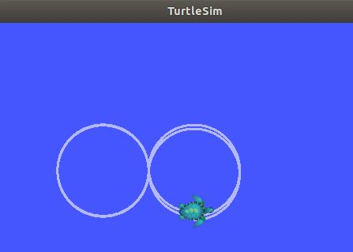

# ROS 패키지 생성 및 코드 실행

ROS에서 기능들을 사용하기 위해서는 node를 생성하고 node를 실행시켜야 한다.
이때 node는 ROS package 안에서 만들어진다. 따라서 node를 생성하기 위해서는 
패키지 설치가 진행되어야 한다.


##### 참고: 아래는 데브코스 자율주행 과정을 따라 생성되었고 xycar_ws를 이미 생성해두었다.<br>
##### -> 만약 생성이 되지 않았다면 3 ROS 설치를 진행한 후 진행.

<br>

## 패키지 생성<hr>
- 패키지를 담을 디렉토리 생성
```py
$ cd ~/xycar_ws/src #패키지 담을 디렉토리로 이동
$ catkin_create_pkg my_pkg1 std_msgs rospy #새로운 패키지 만들기
```
- 생성된 디렉토리를 catkin_make를 통해 build를 한다.<br>(시스템에게 새로운 디렉토리가 생성되었다는 것을 알림)
```py
$ cd ~/xycar_ws 
$ catkin_make
```
> 참고

위 cd ~/xycar_ws, catkin_make 를 동시에 <span style="color:orange">$ cm</span>이라는 명령어로도 실행이 가능하다.
~/.bashrc 파일에서 <span style="color:orange">alias cm='cd ~/xycar_ws && catkin_make'</span> 를 추가 했기 때문

- 생성된 패키지 확인
```
$ rospack find my_pkg1 
```
<br>

## 코드 작성  <hr>

코드 작성시 만들어진 패키지 안에 src폴더로 들어가서 작성 해야한다.
- 코드 생성 폴더로 이동
```py
$ cd ~/xycar_ws/src/my_pkg1/src
```
- 코드 작성(pub8.py)
```py
#!/usr/bin/env python

import rospy
from geometry_msgs.msg import Twist

rospy.init_node('my_node', anonymous=True)
pub = rospy.Publisher('/turtle1/cmd_vel', Twist, queue_size=10)

msg = Twist()
msg.linear.x = 2.0
msg.linear.y = 0.0
msg.linear.z = 0.0
msg.angular.x = 0.0
msg.angular.y = 0.0
msg.angular.z = 1.56

rate = rospy.Rate(0.98)

while not rospy.is_shutdown():
	for i in range(4):
		pub.publish(msg)
		rate.sleep()
	else: msg.angular.z *= -1
```
- 실행 권한을 부여
```py
$ chmod +x pub8.py
$ chmod +x *.py # py 확장자 모두를 주겠다.
```

## 코드 실행 <hr>

총 3개의 터미널이 필요.

```py
# 1번 터미널 rosmaster 실행  
$ roscore 
# 2번 터미널 터틀봇 프로그램 실행
$ rosrun turtlesim turtlesim_node
# 3번 터미널 8자 주행 코드 실행
$ rosrun my_pkg1 pub8.py
```

> 결과



## Subscriber 확인 <hr>
> 참고: roscore 와 pub8.py는 실행되어 있다고 가정한다.

``` py
mg@mg:~/xycar_ws/src/my_pkg1/src$ rostopic list
/rosout
/rosout_agg
/turtle1/cmd_vel
/turtle1/color_sensor
/turtle1/pose
```

- 위 /turtle1/pose의 topic을 확인
```
$ rostopic echo /turtle1/pose
```