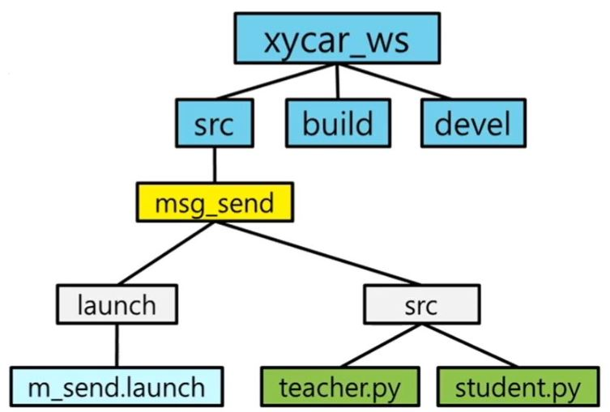
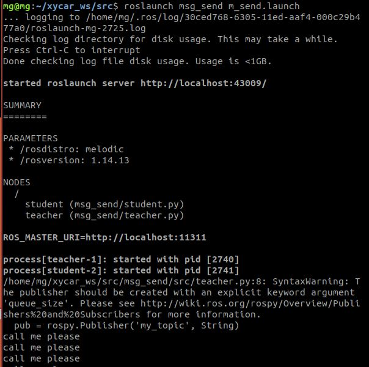

# ROS launch

ROS launch 란 여러개의 노드를 한번에 실행 시킬 수 있도록 도와주는 .launch를 가진 확장자 파일.
> launch파일 예시
```launch
<launch>
    <node pkg="msg_send" type="teacher.py" name="teacher"/>
    <node pkg="msg_send" type="student.py" name="student" output="screen"/>
</launch>
```
2개의 teacher와 student가 동시에 실행된다.

## 생성 및 실행 방법 <hr>



위 그림과 같이 launch 와 src 폴더가 같은 msg_send패키지에 존재해야 실행이 가능하다.
단 src폴더는 catkin_make를 실행하면서 msg_send안에 자동으로 생성 되지만 launch는 생성되지 않으므로 수도으로 설치 해야한다.


```py 
$ ~cd 
$ cs # workspace로 이동
#(중요!)msg_send 패키지를 생성. 이때 std_msgs, rospy를 상속받아 사용한다.
$ catkin_create_pkg msg_send std_msgs rospy

$ cd my_pkg1 #폴더 이동후
$ mkdir launch # launch폴더 생성
$ cm #(중요!)폴더를 생성했다면 이를 ros에게 알려줘야 하기 때문에 build를 한다.
```

이후 
- src 폴더에 student.py , teacher.py 두개의 파일을 생성.
- launch 폴더에는 아래와 같이 m_send.launch를 생성.


> m_send.launch
```launch
<launch>
    <node pkg="msg_send" type="teacher.py" name="teacher"/>
    <node pkg="msg_send" type="student.py" name="student" output="screen"/>
</launch>
```


- node pkg="msg_send" type="teacher.py" name="teacher" 

msg_send package 안에 있는 teacher.py 를 teacher 이름으로 실행시켜라 <br>
(이때 이름은 굳이 py 이름과 같게 할 필요는 없음)

- output="screen"

출력물이 있는 경우 사용. 출력문이 실행 터미널에 생성

실행시 주의 할점: py 코드가 chmod +x가 실행된 상태여야 가능.

<br>

## 코드 실행

```
$ roslaunch msg_send m_send.launch
```

실행결과

