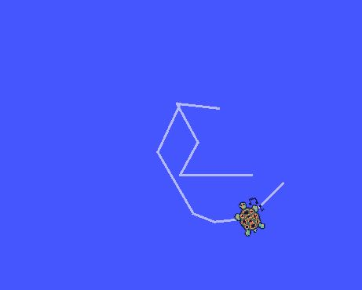

# 거북이 움직이기 
turtlesim을 이용하여 거북이를 움직임
rosnode에 대한 이해와 정보가 어떻게 전달되는지 알 수 있다.
- ## 실행 코드
```py
# 1번 터미널을 열어 ros를 실행
$ roscore
# 2번 터미널을 열어 turtle을 실행 
$ rosrun turtlesim turtlesim_node
# 3번 터미널을 열어 어떤 노드들이 생성되었는지 확인
$ rosnode
# 마지막으로 4번 터미널에 키보드를 통해 거북이를 이동 시킬수있는 node를 생성
$ rosrun turtlesim turtle_teleop_key
```
> 거북이 이동 모습(선을 지나간 경로를 표시)



> 노드실행시 노드들이 점점 증가하는 것을 확인
```py
mg@mg:~$ rosnode list
/rosout
mg@mg:~$ rosnode list
/rosout
/turtlesim
mg@mg:~$ rosnode list
/rosout
/teleop_turtle
/turtlesim
```

