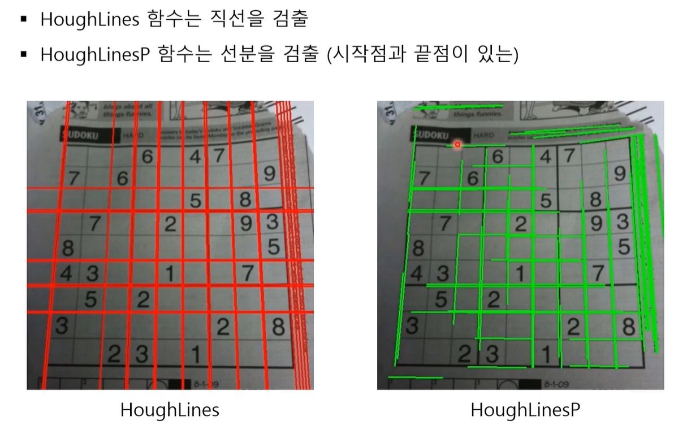

# Hough 변환 차선인식

## 왜 Hough 변환을 사용할까? 

hough 변환을 사용하는 이유
- 선을 검출하기 위해서(특히 직선)
- 직선 검출을 통해 차선을 인식
- cv2에서 hough 변환을 지원한다.

 

## Hough 변환 원리 

x,y 축으로 이루어진 좌표 평면에 있는 많은 점들을 일직선으로 잇는 직선을 찾는다. 이를 위해 x, y축 평면에 점들을 원점에서거리, x축과 이루는 각도 로 구성된 평면에 점을 찍게 된다. 이후 이 평면에서 많은 선들이 겹칠 수록 일직선인 직선일 확률이 높아진다.

- 위 내용은 parameter space내용이다. 하지만 만약 y축과 평행한 직선의 경우 기울기가

## 각 특징 

|x,y 좌표 평면|parameter spaece|hough transform|
|---|---|---|
|x축|각도 m |각도 θ(세타)|
|y축|원점으로 부터 거리 b|원점으로 부터 거리 ρ(로우)|
|실제 화면|y축과 평행한 경우 표현x|y축과 평행하도 표현 가능|

## hough 변환 종류 

참고: https://wkdtjsgur100.github.io/Hough-Transform/