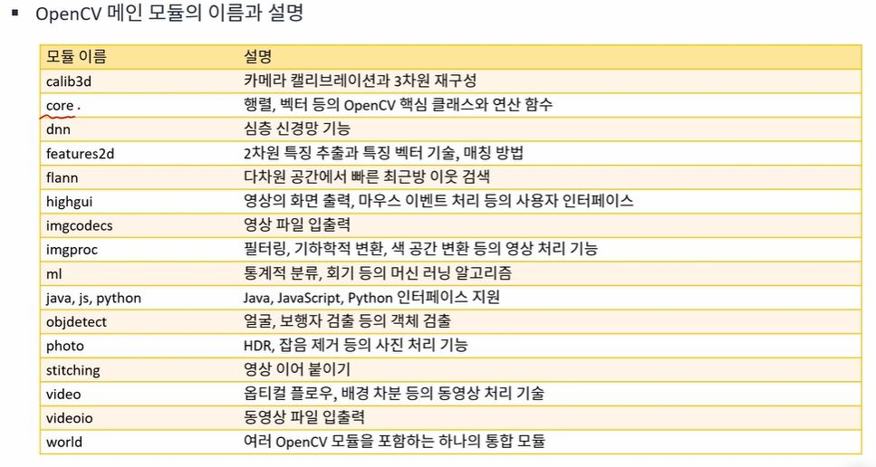

# OpenCv 

OpenCv란 intel의 주도로 2006년에 처음 나온 영상처리에 특화된 오픈소스 라브러리이다.

## 사용 이유 

1. C/C++ , python 등 다양한 언어를 지원하고 또한 window linux 등 다양한 운영체제도 지원한다.
2. cpu 뿐만 아니라 GPU 사용도 지원한다.

## OpenCv 구성 

> OpenCv 모듈
- OpenCv 모듈이라고 부르는 다수의 라이브러리들의 집합
- OpenCv 모듈은 크게 메인 모듈과 추가 모듈로 나눌 수 있음.
1. OpenCv 메인 모듈

    핵심 기능, 널리 사용되는 기능, 기반 기능
2. OpenCv 추가 모듈

    최신 기능, 널리 사용되지 않는 기능, 특허, HW 의존적 기능(CUDA)등

