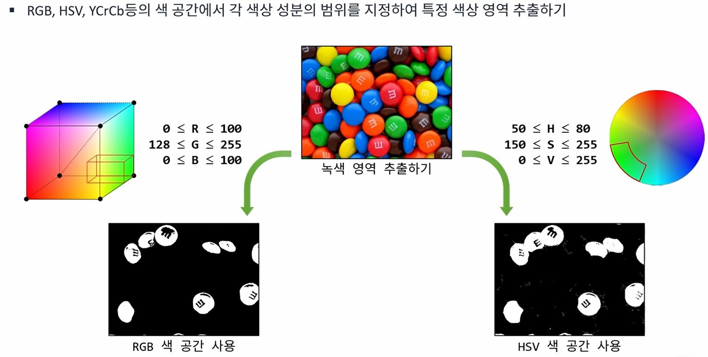

# 컬러 영상처리

RGB , HSV , YCrCb를 이용하여 색상을 검출 할 수 있다.  
RGB, HSV에 대한 내용을 앞에서 알아봤으므로 YCrCb에 대해 알아보자

YCbCr 모델은 RGB에서 밝기 성분(Y), 색차정보(Cb,Cr)를 저장한다.  
-> 별도의 색상변환을 하지 않아도 되는 장점을 갖는다. 즉 처리할 데이터 양이 감소한다.

RGB에서 색상의 경계를 더 뚜렿하게 변환한다.
하지만 실제 차도는 색상이 일정하지 않는 경우도 많으므로 HSV와 같이 
색상을 묶어서 검출하는 것이 더 유리 할 수도 있다. 

 

-> 어떤 변환이 유리한지 적재적소에 넣는 것이 중요 