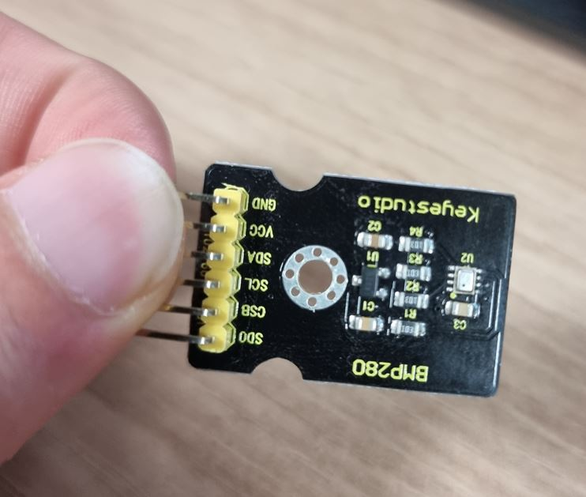

# 통신 총 정리
//업데이트 22.05.08

- 통신에는 크게 3가지로 나눌 수 있다
  - 동기통신 비동기 통신
  - 직렬 병렬 통신
  - 전이중 반이중 통신
- 통신의 예시로는 URAT, SPI , I2C , CAN(차량특화) 등이 존재 한다.
  - 추가! GPIO는 통신만을 말하는 것이 아니다 따라서 통신이 될수도 있고 아닐 수도 있고 통신이 동기 일수도 있고 아닐 수도 있다. 
  - 예를들면 output mode로 할건지 input모드로 할건지 등 달라질 수 있다.
- RaspberryPi와 아두이노 뿐 아니라 여러 방면 많이 사용(나는 주로 Raspberry를 이용)
  
> 라즈베리파이 vs 아두이노

||라즈베리|아두이노|
|---|---|----|
|OS|있어야지 동작가능|없어도가능|
|제어|운영체제 내에서 프로그래밍 제어|직접 제어|
|성능|높다|낮다|
|기반언어|파이썬,자바,C 등..| C한가지|
 

> 동기 비동기통신

- 둘을 구분하는 가장큰 차이는 clock의 유무로 판단한다.
- 둘다 직렬 통신에 해당된다.

||동기 Synchronous|비동기 Asynchronous|
|---|---|----|
|clock|있음|없음|
|데이터 전송속도|빠름|느림(상대적)|
|연결 난이도|비교적 어렵다|비교적 손쉽게 통신가능|
|정확성|높다|낮다(비교적 요새는 그렇게 나쁘지 않음)|
|예시|I2C, SPI, USART(s가 추가됨!) | UART, CAN|

> 직렬 병렬 통신

- 직병렬 차이는 동시에 송수신이 가능한지 여부이다.

- 직렬 통신(시리얼 통신): 
  - 데이터를 한번에 하나의 비트만 전송한다.
  - 거의 대부분의 통신에서 사용
  - 구현이 쉽다.
  - 전이중(FULL-duplex) 방식: 두 디바이스간 통신선이 두 개(송신선, 수신선), 송신선과 수신선선이 각각 존재하므로 데이터 송신과 동시에 수신이 가능
  - I2C, UART, SPI, PCIe 등 대분이 여기 속한다.
- 병렬통신
  - 여러 개의 병렬 채널 위로 동시에 여러 개의 데이터 신호를 보내는 방식
  - 구현이 기술적인 어렵고, 비용이 많이 듬
  - 전이중(full-duplex) 방식 사용. 송신과 수신 라인이 다름. 두 장치가 동시에 데이터 전송 가능
  - 대표적으로 PCI 통신(PC 메인보드에서 사용) 이있다.

> 전이중 반이중 통신
- ## 전이중(FULL-duplex) 방식:
  - 특징 
    - 두 디바이스간 통신선이 두 개(송신선, 수신선), 
    - 송신선과 수신선선이 각각 존재하므로 데이터 송신과 동시에 수신이 가능
  - 장단점
    - 장점: 데이터를 통시에 송수신이 가능
    - 단점: 통신 선이 많아지고 이로인해 장거리 통신에서 불리하다.
  - 예시
    - SPI 통신이 여기 속함(MOSI, MISO 2개를 사용)
    -  USART, UART (TX(송신), RX(수신))
 

- ## 반이중(half-duplex) 방식:
  - 특징
    - 두 디바이스 간 통신선이 하나
    - 한쪽 디바이스에서 송신과 수신 모두 가능
    - 하나의 통신선으로 송신과 수신을 해야 하므로 송신과 수신을 동시에 할 수 없다. 한쪽이 송신 시 다른 쪽에서는 수신만 가능
  - 장단점
    - 장점: 통신선 한개만을 이용하면 된다.
    - 단점: 동시에 데이터를 주고 받을 수가 없다. ex) 무전기
  - 예시
    - I2C 통신이 여기 속함 (SDA 1개 사용)
## 대표적 통신
#

> I2C (Inter-Integrated Circuit) 통신

- 특징
  - 아두이노, 라즈베리파이 와 센서간 통신을 위해 많이 사용
  - 주로 적은 양의 데이터 송수신을 할때 사용 
  - 예시) 온도계, 기압계, 자이로 센서
  - SCL을 이용하여 clock을 동기화 하므로 동기통신에 속함.
  - 동기통신이므로 오차가 적다.
  - 2개의 채널을 이용하여 통신(SDA, SCL)

- 내가 실험한 사용 모듈
  - 라즈베리파이, BMP 280센서 이용하여 테스트함
  - 
  - BMP 280: 정밀한 대기압 센서, 온도 측정가능
  - I2C 통신을 위해서는 RaspberryPI 설정에서 i2c 통신을 Enable 해야함

- 장점
  - 통신을 위한 핀을 SDA, SCL 2개만 사용하면 된다.(전원 공급을 위한 VCC GND 제외)
    - SDA (Serial Data): 시리얼 데이터 통신을 의미하며 실질적인 데이터 송수신에 사용
    - SCL (Serial Clock): 마스터와 슬레이브간에 clock을 맞추고자 사용 
    - SDA SCL는 기본적으로 풀업 저항을 사용한다.  따라서 SCL이 High 에서 Low로 내려가는 순간   start로 인식을 한다. 그리고 High로 올라가는 순간 SDA를 통한 데이터 전송을 더이상 받지 않는다.
    
    - 간단하게 정리하면 SCL을 통해 데이터를 입력받는 구간을 정하고 SDA를 통해 데이터를 입력 받음
    - address의 경우 7bit data의 경우 8bit을 사용. 정도만 알아두자.
  - GPIO는 소량만 제어가 가능하지만 I2C는 다량의 장치 연결이 가능하다.
  - USART 통신보다 많이 사용됨()

- 단점
  - SDA SCL두개만 이용하기 때문에 상대적으로 SPI통신보다 느리다. 

> SPI (Serial Peripheral Interface)통신

- 특징
  - 아두이노, 라즈베리파이 와 센서간 통신을 위해 많이 사용
  - 주로 많은 양의 데이터 송수신을 위해 사용
  - 예) LCD , OLED 모니터 관련
  - 4개의 핀을 사용한다.(SCK, MOSI, MISO,CS)
    - CS slave 선택 (chip select)
    - SCK : 클럭
    - MOSI : Master Out Slave In 마스터 -> 슬레이브
    - MISO : Master In Slave Out 마스터 <- 슬레이브 
- 직접 실험한 모듈(OLED)

- 장점:
  - I2C 대비 빠르다
  - 동시에 송수신이 가능
- 단점:
  - 연결 핀이 많다.

> UART , USART

- 특징
  - UART , USART는 시리얼 통신에 기본 
  - 시리얼 통신에는 USB, Bluetooth도 있다.
  - 직렬 통신에 해당된다.
  -  비용이 저렴하며 단순하다.
  -  단 처리량과 속도가 다른 프로토콜에 비해 매우 떨어진다.
  -  여러 디바이스와 연결 할 수 없는 1대1 (point to point)구조이다.
  -  통신거리가 20m 애매하다.

- 직접 실험 모듈
  - UART통신을 실험 (유선으로 진행)
  - stm32F103 MUC, esp32
  - TX, RX 2가지 통신선 이용
  - 목표 LED를 1초 주기로 깜빡

||UART|USART|
|---|---|---|
|통신선|TX(송신), RX(수신)| TX, RX , CK(clock)|
|동기여부|비동기|동기| 
||직렬통신|직렬통신|

- 참고 
  - uart통신의 경우 비동기 통신이기 때문에 데이터의 시작과 끝을 구별할 방법이 필요하다. uart의 전송 데이터의 시작 비트(Always Low))는 항상 0이고, 종료 비트(Always High)는 항상 1이다. 
  그리고 중간 8bit의 데이터 값을 바탕으로 송수신을 한다. 또한 직렬 통신으로서 2개의 선을 이용하여 통신한다.
  - IDLE(아이들 상태)시에는 1의 데이터를 전송합니다. 
> CAN 통신